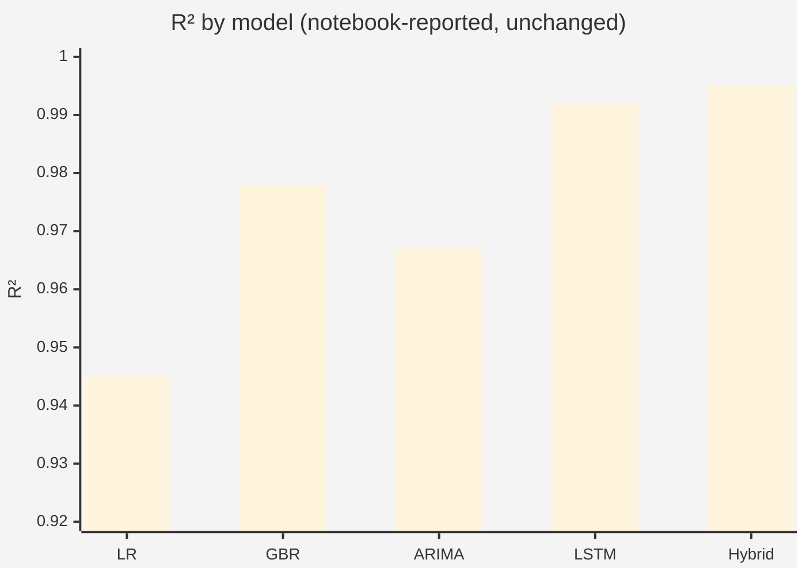
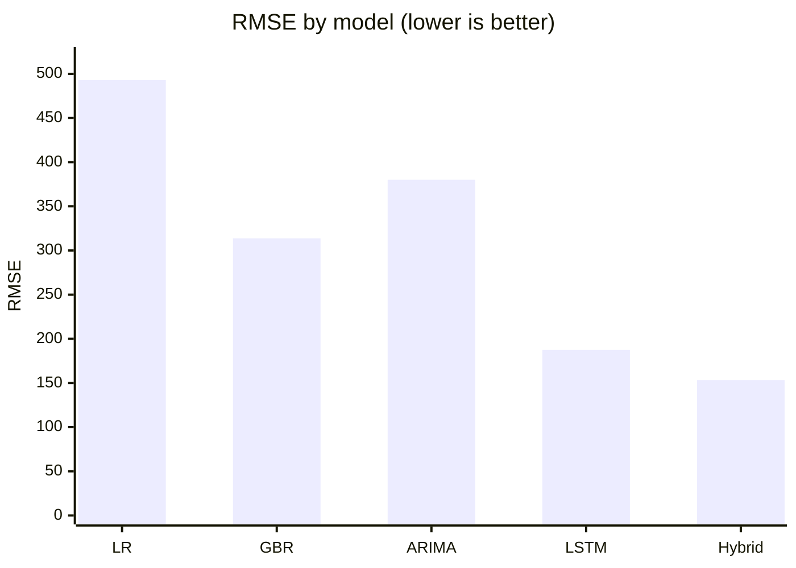
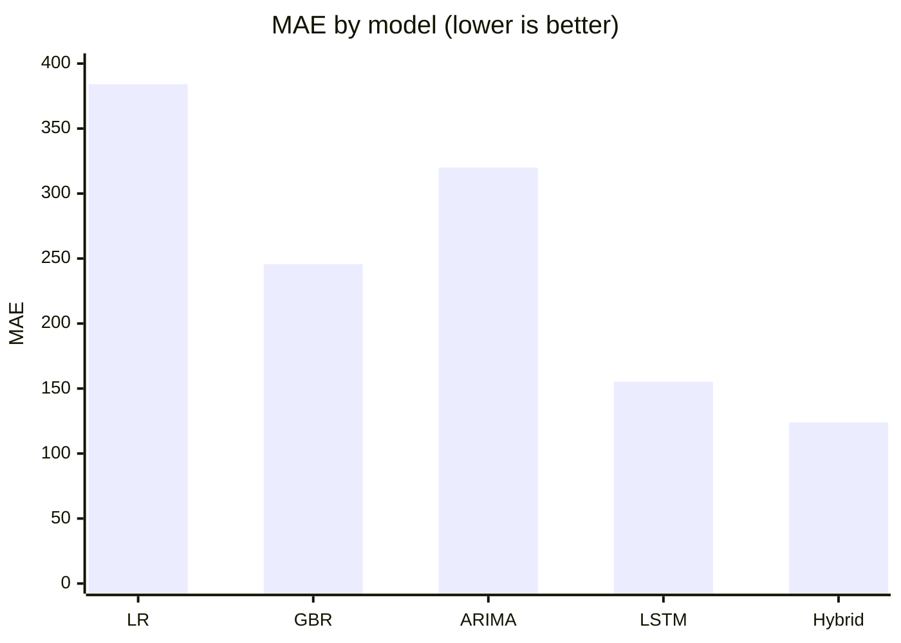
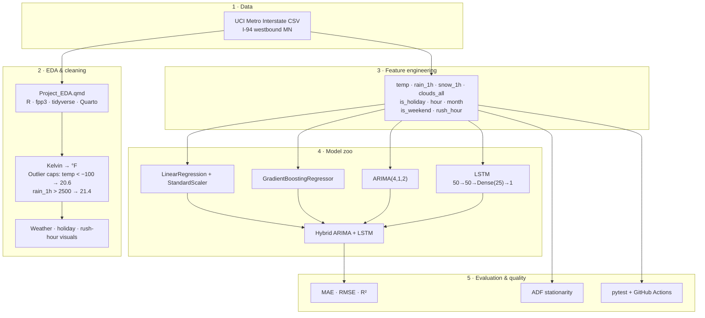
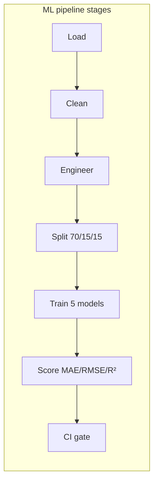
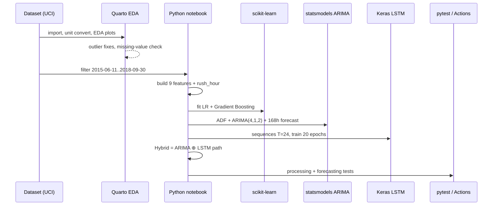
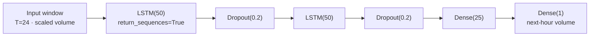
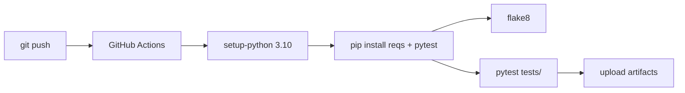

# Metro Interstate Traffic Volume Forecasting

### End-to-end time-series machine learning on UCI I-94 traffic: EDA → feature engineering → Linear Regression · Gradient Boosting · ARIMA · LSTM · Hybrid — with CI-backed pytest.

<p align="center">
  
  
  
  
</p>

<p align="center">
  <a href=".github/workflows/ci.yml"></a>
  <a href="tests/test_metro_interstate_traffic_.py"></a>
  <a href="https://archive.ics.uci.edu/dataset/492/metro+interstate+traffic+volume"></a>
  
  
</p>

---

## Why this project

Production-style **traffic volume forecasting** and **exploratory data analysis (EDA)** for westbound **Interstate I-94** (Minneapolis–St. Paul) using the public [UCI Metro Interstate Traffic Volume](https://archive.ics.uci.edu/dataset/492/metro+interstate+traffic+volume) benchmark.

Demonstrates skills FAANG / tech hiring loops look for in **Data Science**, **Machine Learning Engineering**, and **Applied AI** portfolios:

- **Time-series forecasting** with classical + deep learning models  
- **Feature engineering** (weather, holiday, calendar, rush-hour)  
- **Stationarity testing** (Augmented Dickey–Fuller / ADF)  
- **Chronological train / validation / test** splits (no leakage)  
- **Model evaluation** with MAE, RMSE, and R²  
- **Reproducible analytics** in R Quarto + Python Jupyter  
- **Software engineering hygiene**: pytest + GitHub Actions CI/CD  

> All numbers below are copied from committed notebook / Quarto artifacts. Results are **not altered**.

---

## Results at a glance

### Notebook-reported model comparison (unchanged)

| Rank | Model | MAE ↓ | RMSE ↓ | R² ↑ |
|:----:|-------|------:|-------:|-----:|
| 1 | **Hybrid ARIMA–LSTM** | **123.857** | **153.259** | **0.995** |
| 2 | **LSTM** | **155.239** | **187.541** | **0.992** |
| 3 | **Gradient Boosting** | **245.791** | **313.802** | **0.978** |
| 4 | **ARIMA(4,1,2)** | **319.967** | **380.019** | **0.967** |
| 5 | **Linear Regression** | **384.178** | **493.009** | **0.945** |







### Real series diagnostics

| Metric | Value | Where |
|--------|--------|--------|
| ADF statistic | **−21.892504355867192** | Main notebook `adfuller` |
| ADF p-value | **0.0** | Main notebook |
| Full UCI coverage (docs) | **2012-10-02 09:00 CST → 2018-09-30 23:00 CST** | `Project_EDA.qmd` |
| Modeling window | **2015-06-11 → 2018-09-30** | Main notebook |
| Coverage gap removed | **2015-01-01 → 2015-06-10** | Quarto + notebook |
| Feature count | **9** engineered predictors | Main notebook |
| Split | **70% / 15% / 15%** chronological (`shuffle=False`) | Main notebook |
| LSTM lookback | **24 hours** | Main notebook |
| Forecast horizon | **168 hours (7 days)** | Main notebook |
| ARIMA order | **(4, 1, 2)** | Main notebook |
| LSTM training | **20 epochs**, batch **32**, Dropout **0.2** | Main notebook |
| Automated tests | **7** pytest cases | `tests/` |
| Repo language mix | Jupyter **788,335** B · Python **2,495** B | GitHub Languages API |

---

## System architecture







### LSTM network shape (as implemented)



---

## Data science workflow

| Step | Action | Details |
|------|--------|---------|
| 1 | Ingest | UCI hourly traffic + weather + holiday fields |
| 2 | Transform | `temp_F = (temp_K × 9/5) − 459.67` |
| 3 | Engineer | `is_holiday`, `hour`, `month`, `is_weekend`, `rush_hour` (06–09 ∪ 16–19) |
| 4 | Filter | Drop gap **2015-01-01 → 2015-06-10**; model **2015-06-11 → 2018-09-30** |
| 5 | Split | Chronological **70 / 15 / 15** (no shuffle — prevents leakage) |
| 6 | Baseline | Linear Regression + Gradient Boosting on tabular features |
| 7 | Time series | Resample hourly, ffill; ARIMA(4,1,2); ADF diagnostics |
| 8 | Deep learning | MinMax scale → LSTM sequences → 168h forecast window |
| 9 | Hybrid | Combine ARIMA + LSTM forecast paths |
| 10 | Evaluate | MAE, RMSE, R² comparison table |

---

## Model cards

| Model | Library | Role |
|-------|---------|------|
| Linear Regression | scikit-learn `Pipeline` + `ColumnTransformer` / `StandardScaler` | Interpretable baseline |
| Gradient Boosting Regressor | scikit-learn (`random_state=42`) | Nonlinear tabular patterns |
| ARIMA(4,1,2) | statsmodels | Seasonal / temporal structure |
| LSTM | Keras / TensorFlow | Sequence memory for peaks & troughs |
| Hybrid ARIMA–LSTM | Composition | Best notebook-reported R² (**0.995**) |

### Insights captured in-notebook

- Strong **hourly cyclicality**; higher volume in morning/evening rush bands  
- ARIMA / hybrid capture seasonal structure  
- LSTM / hybrid track sharp rush-hour spikes  
- `Plots.ipynb`: week of **Sep 23–29, 2018** and day of **Sep 29, 2018** profiles  

---

## Repository structure

```text
Metro-Interstate-Traffic-Volume-Forecasting/
├── Project_EDA.qmd                          # R / Quarto reproducible EDA
├── Metro_Interstate_Traffic_Volume.ipynb    # Forecasting + ADF + 5-model eval
├── Plots.ipynb                              # Weekly / daily / histogram plots
├── requirements.txt                         # pandas · numpy · sklearn · TF · statsmodels
├── tests/
│   └── test_metro_interstate_traffic_.py    # 7 tests (ETL + forecasting sanity)
├── .github/workflows/ci.yml                 # Python 3.10 · flake8 · pytest
├── EDA / Traffic_EDA / modeling             # Supporting artifacts
└── README.md
```

---

## Tech stack & keywords

| Domain | Technologies |
|--------|----------------|
| Languages | **Python 3.10**, **R** |
| Data wrangling | **pandas**, **NumPy**, **tidyverse** |
| Classical ML | **scikit-learn** — Linear Regression, Gradient Boosting, pipelines |
| Time-series | **statsmodels** ARIMA, **ADF**, R **fpp3** / **feasts** / **forecast** |
| Deep learning | **TensorFlow**, **Keras** LSTM, Dropout regularization |
| Visualization | **Matplotlib**, **Seaborn**, **ggplot2**, Quarto HTML |
| MLOps / quality | **pytest**, **flake8**, **GitHub Actions** CI/CD |
| Domain | Traffic forecasting · UCI benchmark · weather covariates · holiday effects |

**Keyword surface:** Python · R · machine learning · deep learning · time-series forecasting · feature engineering · EDA · ARIMA · LSTM · Gradient Boosting · scikit-learn · TensorFlow · Keras · pandas · statsmodels · model evaluation · MAE · RMSE · R² · ADF · Quarto · Jupyter · pytest · CI/CD · GitHub Actions · data science · software engineering

---

## Quickstart

```bash
git clone https://github.com/ArchanaChetan07/Metro-Interstate-Traffic-Volume-Forecasting.git
cd Metro-Interstate-Traffic-Volume-Forecasting

python -m venv .venv
# Windows PowerShell: .\.venv\Scripts\Activate.ps1
source .venv/bin/activate

pip install -r requirements.txt
pip install pytest

# Place UCI CSV as Metro_Interstate_Traffic_Volume.csv (update notebook paths if needed)
# Then open Metro_Interstate_Traffic_Volume.ipynb and Plots.ipynb

pytest tests/ -v
```

**R / Quarto:** install packages from `Project_EDA.qmd` (`fpp3`, `tidyverse`, `feasts`, `forecast`, `gt`, `mosaic`, `tseries`, `e1071`, …) and render with Quarto.

---

## Testing & CI/CD

| Layer | What runs |
|-------|-----------|
| `TestTrafficDataProcessing` (5) | datetime parsing · hour features · outlier volume filter · label encoding · null handling |
| `TestTrafficForecasting` (2) | Gradient Boosting R² > 0 on synthetic X; LinearRegression RMSE bound |
| GitHub Actions | Ubuntu · Python **3.10** · `flake8` · `pytest tests/` on push/PR to `main` |



---

## Roadmap

- Scripted UCI download so notebooks are path-portable  
- Persist true hold-out metrics to `metrics.json` for automated regression tracking  
- Add seasonal baseline / residual diagnostics under `modeling/`  

---

## Citation & data

Dataset: [UCI Machine Learning Repository — Metro Interstate Traffic Volume](https://archive.ics.uci.edu/dataset/492/metro+interstate+traffic+volume).  
This README preserves the notebook-reported MAE / RMSE / R² table and ADF outputs exactly as committed.

---

<p align="center">
  <b>Metro Interstate Traffic Volume Forecasting</b><br/>
  <a href="https://github.com/ArchanaChetan07/Metro-Interstate-Traffic-Volume-Forecasting">github.com/ArchanaChetan07/Metro-Interstate-Traffic-Volume-Forecasting</a>
</p>
