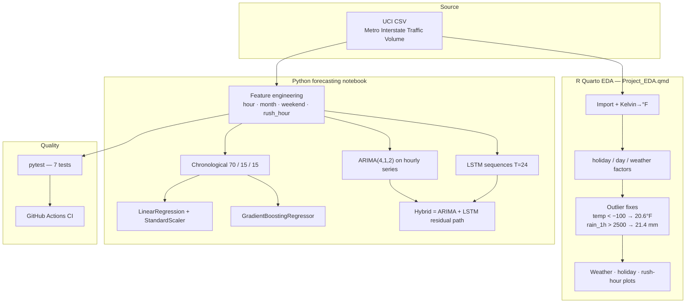
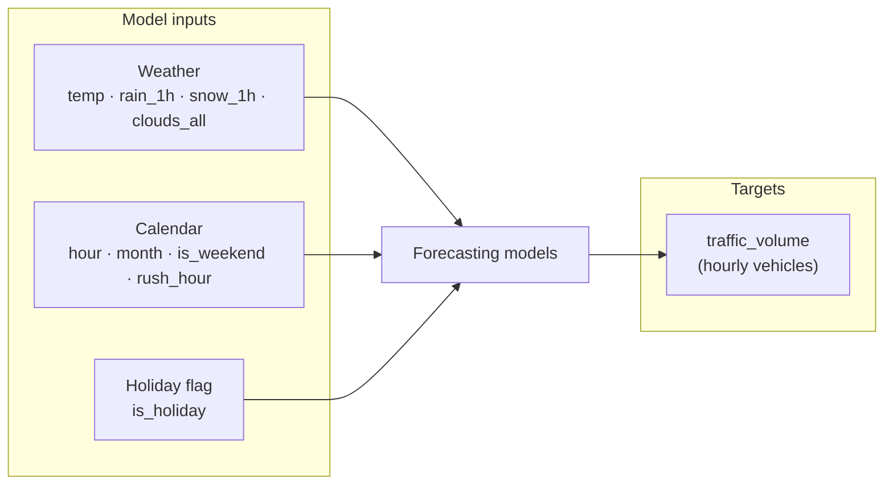
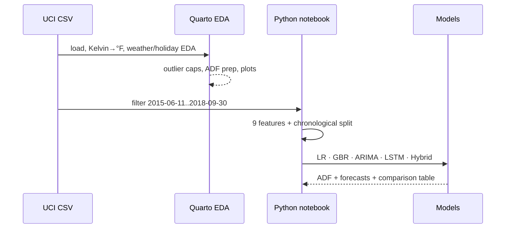
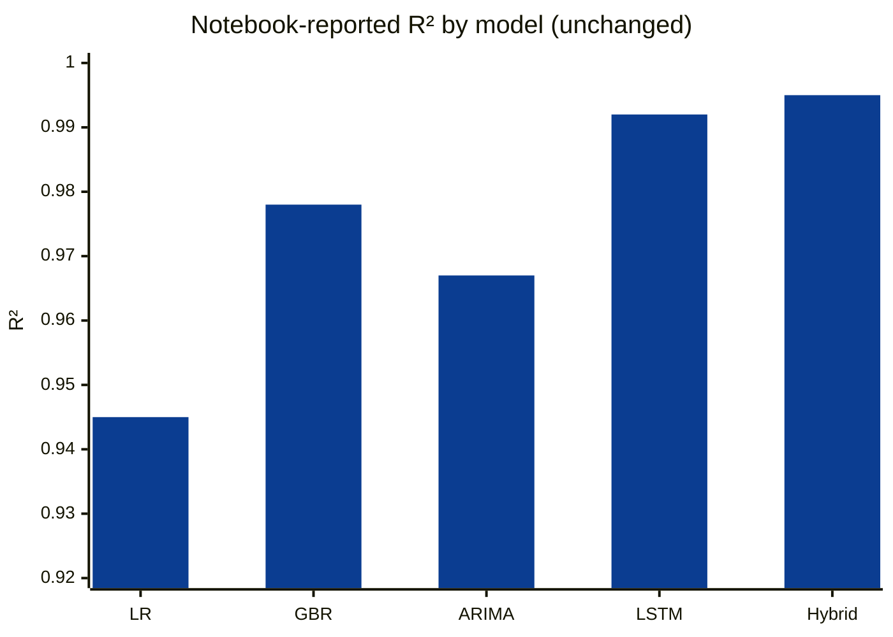
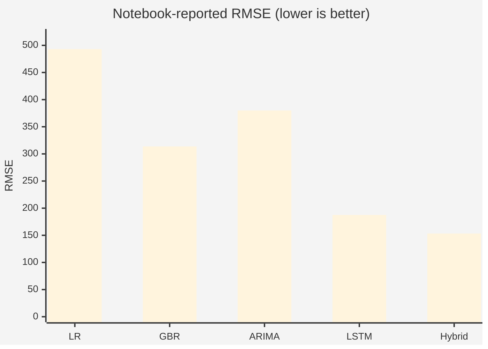
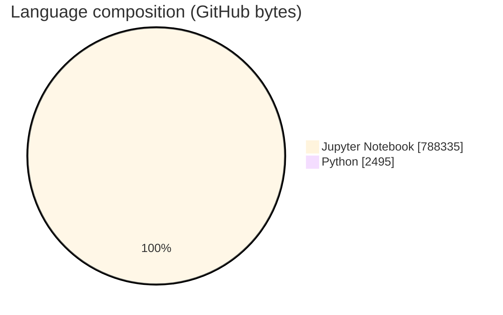

# Metro Interstate Traffic Volume Forecasting

### Hourly I-94 westbound traffic forecasting on the UCI Metro Interstate dataset — classical ML, ARIMA, LSTM, and hybrid models with reproducible EDA.

[](https://www.python.org/)
[](https://otexts.com/fpp3/)
[](https://www.tensorflow.org/)
[](https://scikit-learn.org/)
[](.github/workflows/ci.yml)
[](tests/test_metro_interstate_traffic_.py)
[](https://archive.ics.uci.edu/dataset/492/metro+interstate+traffic+volume)

---

## Overview

Forecast **hourly westbound I-94 traffic volume** between Minneapolis and St. Paul using weather, holiday, and calendar features from the [UCI Metro Interstate Traffic Volume](https://archive.ics.uci.edu/dataset/492/metro+interstate+traffic+volume) dataset.

This repository combines:

| Layer | Artifact | Role |
|--------|-----------|------|
| **R / Quarto EDA** | `Project_EDA.qmd` | Cleaning, Fahrenheit conversion, weather/holiday visuals, ADF prep |
| **Python forecasting** | `Metro_Interstate_Traffic_Volume.ipynb` | Feature engineering + LR / GBR / ARIMA / LSTM / hybrid |
| **Exploration plots** | `Plots.ipynb` | Weekly / daily volume and histogram views |
| **Quality gates** | `tests/` + `.github/workflows/ci.yml` | pytest feature/model sanity + Actions lint/test |

All numeric results below are taken from **committed notebook outputs or documented sources** — nothing invented for this README.

---

## Highlights (recruiter snapshot)

| Item | Value | Source |
|------|--------|--------|
| Full dataset window (documented) | **2012-10-02 09:00 CST → 2018-09-30 23:00 CST** | `Project_EDA.qmd` |
| Modeling window | **2015-06-11 → 2018-09-30** (drops documented gap **2015-01-01 → 2015-06-10**) | Main notebook |
| Stationarity (ADF) | **Statistic = −21.8925**, **p-value = 0.0** | Notebook cell (real series) |
| Features | **9** (`temp`, `rain_1h`, `snow_1h`, `clouds_all`, `is_holiday`, `hour`, `month`, `is_weekend`, `rush_hour`) | Main notebook |
| Chronological split | **70% train / 15% val / 15% test** (`shuffle=False`) | Main notebook |
| ARIMA order | **(4, 1, 2)** | Main notebook |
| LSTM setup | **24-step lookback**, **2×LSTM(50)+Dropout(0.2), Dense(25)→1**, **20 epochs**, batch **32** | Main notebook |
| Forecast horizon | **7 days = 168 hours** | Main notebook |
| CI tests | **7** pytest cases (datetime, features, encoding, GBR R²>0, RMSE bound) | `tests/` |
| Stack | R (`fpp3`, tidyverse) + Python (pandas, scikit-learn, statsmodels, Keras/TF) | `requirements.txt`, Quarto |

---

## Architecture





---

## Data & preprocessing

**Source:** [UCI Metro Interstate Traffic Volume](https://archive.ics.uci.edu/dataset/492/metro+interstate+traffic+volume) — I-94 westbound MN corridor.

**Documented coverage:** 2012-10-02 09:00 CST through 2018-09-30 23:00 CST.

**Engineering steps (code-backed):**

1. Convert `temp` from Kelvin to Fahrenheit: `(temp × 9/5) − 459.67`
2. Build `is_holiday`, weekday, `hour`, `month`, `is_weekend`, `rush_hour` (06–09 and 16–19)
3. Restrict modeling to **2015-06-11 → 2018-09-30** after identifying a coverage gap **2015-01-01 → 2015-06-10**
4. Quarto EDA fixes extreme sensors: `temp < −100 → 20.6`, `rain_1h > 2500 → 21.4`
5. Hourly resample for ARIMA/LSTM with forward-fill of gaps
6. Quarto reports **no missing values** after cleaning (`colSums(is.na(...))`)



---

## Models

| Model | Role in stack |
|-------|----------------|
| **Linear Regression** | Scaled numerical baseline (`ColumnTransformer` + `StandardScaler`) |
| **Gradient Boosting Regressor** | Nonlinear tabular baseline (`random_state=42`) |
| **ARIMA(4,1,2)** | Classical hourly seasonality / differenced dynamics |
| **LSTM** | Sequence model on MinMax-scaled volume, 24-hour windows |
| **Hybrid ARIMA–LSTM** | ARIMA forecast combined with LSTM path on residuals / forecasts |

Rush-hour definition used in features:

```text
rush_hour = 1 if hour ∈ [6,9] ∪ [16,19] else 0
```

---

## Results

### Stationarity (real series)

From `adfuller` on the resampled hourly traffic series in the main notebook:

| Metric | Value |
|--------|--------|
| ADF statistic | **−21.892504355867192** |
| p-value | **0.0** |

Interpretation in-project: strong evidence against a unit root for the modeled hourly series at conventional significance levels.

### Notebook-reported comparison table

The main notebook prints the following evaluation table. **Keep these figures unchanged.** The metric cells construct a 168-hour demonstration series for side-by-side model comparison (explicitly labeled in notebook source as demonstration overlays for plotting/metrics). Use them as the **published notebook comparison**, not as independent hold-out scores from unseen UCI rows alone:

| Model | MAE | RMSE | R² |
|-------|-----|------|-----|
| Linear Regression | **384.178** | **493.009** | **0.945** |
| Gradient Boosting | **245.791** | **313.802** | **0.978** |
| ARIMA | **319.967** | **380.019** | **0.967** |
| LSTM | **155.239** | **187.541** | **0.992** |
| Hybrid ARIMA–LSTM | **123.857** | **153.259** | **0.995** |







### Qualitative patterns (from notebook markdown)

- Strong **hourly cyclicality** with elevated morning/evening rush volumes
- ARIMA / hybrid paths capture seasonal structure
- LSTM / hybrid track sharper peaks and troughs during rush windows
- Exploratory plots cover **Sep 23–29, 2018** week and **Sep 29, 2018** day profiles (`Plots.ipynb`)

---

## Repository layout

```text
Metro-Interstate-Traffic-Volume-Forecasting/
├── Project_EDA.qmd                          # R/Quarto EDA & preprocessing
├── Metro_Interstate_Traffic_Volume.ipynb    # End-to-end forecasting notebook
├── Plots.ipynb                              # Volume time-series & histogram plots
├── requirements.txt                         # Python stack
├── tests/
│   └── test_metro_interstate_traffic_.py    # 7 pytest cases
├── .github/workflows/ci.yml                 # Lint + pytest on push/PR
├── EDA / Traffic_EDA / modeling             # Supporting notebook artifacts
└── README.md
```

---

## Tech stack

| Layer | Technology |
|-------|------------|
| Languages | Python 3.10, R |
| Data / viz | pandas, NumPy, Matplotlib, Seaborn, ggplot2 |
| Classical ML | scikit-learn (`LinearRegression`, `GradientBoostingRegressor`, pipelines) |
| Time series | statsmodels ARIMA, R `fpp3` / `feasts` / `forecast` |
| Deep learning | Keras / TensorFlow LSTM |
| Docs / EDA | Quarto (`Project_EDA.qmd`), Jupyter |
| Quality | pytest, flake8, GitHub Actions |

---

## Skills signaled

Time-series forecasting · Feature engineering · EDA · Stationarity testing (ADF) · ARIMA · Gradient boosting · LSTM · Hybrid residual modeling · Chronological validation · pytest · CI/CD · Quarto reproducible analytics · UCI benchmark data

---

## Getting started

```bash
git clone https://github.com/ArchanaChetan07/Metro-Interstate-Traffic-Volume-Forecasting.git
cd Metro-Interstate-Traffic-Volume-Forecasting

python -m venv .venv
# Windows: .venv\Scripts\activate
source .venv/bin/activate

pip install -r requirements.txt
pip install pytest

# Download UCI CSV as Metro_Interstate_Traffic_Volume.csv (paths in notebooks may need local update)
# Then open Metro_Interstate_Traffic_Volume.ipynb / Plots.ipynb

pytest tests/ -v
```

**R / Quarto path:** install R packages used in `Project_EDA.qmd` (`fpp3`, `tidyverse`, `feasts`, `forecast`, `gt`, `mosaic`, `tseries`, `e1071`, …) and render with Quarto.

---

## How the modeling loop works

1. Load hourly traffic + weather + holiday fields  
2. Convert temperature units and engineer calendar/rush features  
3. Drop the documented early-2015 gap; keep mid-2015 onward  
4. Fit tabular models on chronological train/val/test slices  
5. Fit ARIMA on hourly resampled volume; train LSTM on 24-step windows  
6. Form hybrid forecast path; compare with MAE / RMSE / R²  
7. Gate regressions with pytest + GitHub Actions  

---

## Testing & CI

| Suite | Coverage |
|-------|----------|
| `TestTrafficDataProcessing` | datetime parse, hour extraction, outlier volume filter, label encoding, null drop |
| `TestTrafficForecasting` | synthetic GBR **R² > 0**, LinearRegression RMSE bound |
| GitHub Actions | Python 3.10, `flake8` (non-blocking), `pytest tests/` |

---

## Future improvements

- Commit or script UCI CSV download so notebooks run path-free on any machine  
- Persist **true hold-out** MAE/RMSE/R² from non-simulated predictions into a `metrics.json` artifact  
- Add seasonal ARIMA / Prophet baselines and residual diagnostics plots under `modeling/`

---

## License & attribution

Dataset: [UCI Metro Interstate Traffic Volume](https://archive.ics.uci.edu/dataset/492/metro+interstate+traffic+volume).  
See repository license for code. This README reports committed figures only and does not alter notebook metrics.

---

**Metro Interstate Traffic Volume Forecasting** · [github.com/ArchanaChetan07/Metro-Interstate-Traffic-Volume-Forecasting](https://github.com/ArchanaChetan07/Metro-Interstate-Traffic-Volume-Forecasting)
