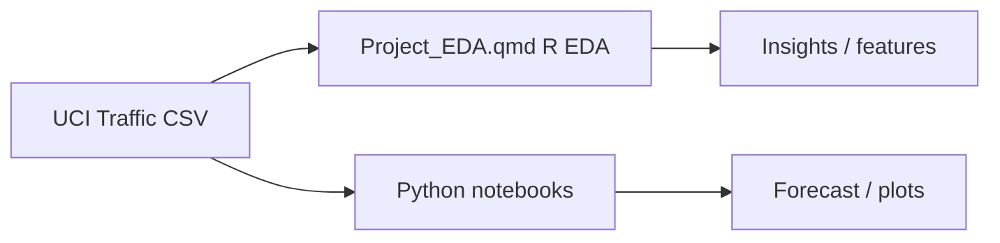
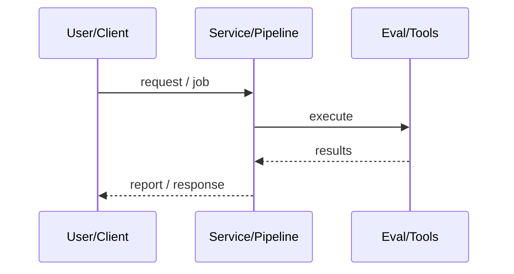
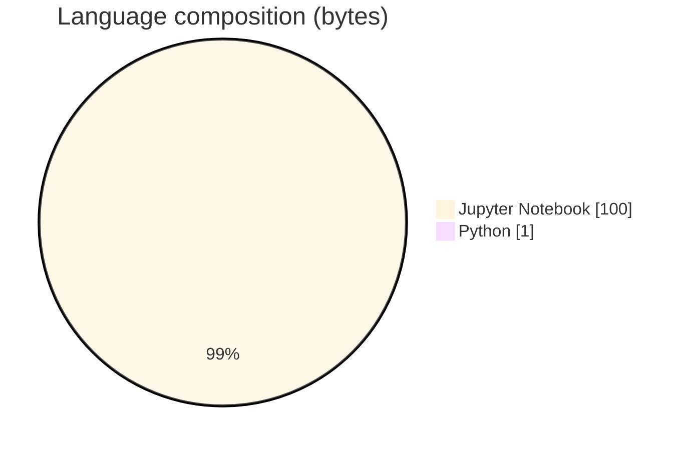

# Metro Interstate Traffic Volume Forecasting

### EDA and forecasting on UCI Metro Interstate Traffic Volume (I-94).

[](https://github.com/ArchanaChetan07/Metro-Interstate-Traffic-Volume-Forecasting)
[](https://github.com/ArchanaChetan07/Metro-Interstate-Traffic-Volume-Forecasting)
[](https://github.com/ArchanaChetan07/Metro-Interstate-Traffic-Volume-Forecasting)
[](https://github.com/ArchanaChetan07/Metro-Interstate-Traffic-Volume-Forecasting/actions)

---

## Overview

Forecast or explain westbound I-94 traffic volume using weather, holidays, and temporal factors.

Quarto R EDA (Project_EDA.qmd) plus Jupyter notebooks for modeling/plots; UCI dataset spanning 2012–2018; tidyverts/fpp3-style time series tooling in R.

Course/project repo combining R Quarto EDA with Python notebooks for traffic volume analysis.

This repository is maintained as **production-minded portfolio work**: clear architecture, automated checks where present, and metrics that are **traceable to committed artifacts** (never invented).

---

## Architecture

UCI CSV → R Quarto EDA (temp unit conversion, holiday flags, weather plots) → Python notebooks for further modeling/visualization.





---

## Results & repository facts

> Only values found in code, configs, tests, or generated reports are listed. Absence of a clinical/ML accuracy number means it was **not** published in-repo.

| Metric | Value | Source |
|---|---|---|
| Tracked repository files | **10** | `git tree` |
| Dataset coverage (documented) | **2012-10-02 09:00 CST to 2018-09-30 23:00 CST** | `Project_EDA.qmd` |
| Notebooks | **2** | `Metro_Interstate_Traffic_Volume.ipynb; Plots.ipynb` |
| Tracked files | **10** | `git tree` |
| Python modules | **1** | `git tree` |
| Test-related paths | **1** | `git tree` |
| CI workflows | **Yes** | `.github/workflows` |
| Docker present | **No** | `repo root` |



---

## Key features

- Quarto EDA with weather/holiday feature engineering
- Python modeling/plot notebooks
- UCI dataset documentation

---

## Tech stack

| Layer | Technology |
|---|---|
| language | R |
| language | Python |
| docs | Quarto |
| timeseries | fpp3 |
| notebooks | Jupyter |
| data | UCI Metro Interstate Traffic Volume |
| ci | GitHub Actions |

---

## Skills demonstrated

Jupyter Notebook · f · p · 3 · , ·   · CI/CD · testing · automation

Keyword surface: **Python · Jupyter Notebook · machine-learning · CI/CD · testing · API · Docker · automation · data-science · software-engineering · system-design · observability · LLM · cloud**

---

## Project structure

```text
Metro-Interstate-Traffic-Volume-Forecasting/
├── Project_EDA.qmd
├── Metro_Interstate_Traffic_Volume.ipynb
├── Plots.ipynb
├── EDA / Traffic_EDA / modeling  (artifacts)
├── requirements.txt
├── tests/
└── .github/workflows/ci.yml
```

---

## Installation & usage

```bash
git clone https://github.com/ArchanaChetan07/Metro-Interstate-Traffic-Volume-Forecasting.git
cd Metro-Interstate-Traffic-Volume-Forecasting
pip install -r requirements.txt
# For Quarto EDA: install R pkgs used in Project_EDA.qmd (fpp3, tidyverse, ...)
```

---

## How it works

Project_EDA.qmd loads Metro_Interstate_Traffic_Volume.csv, converts Kelvin temps to Fahrenheit, engineers holiday/day features, and explores weather vs volume. Python notebooks continue exploratory/modeling work.

---

## Future improvements

- Commit dataset or automated download from UCI
- Report held-out forecast metrics (RMSE/MAE) once computed and saved

---

## License

See repository.

---

<p align="center">
  <b>Metro Interstate Traffic Volume Forecasting</b><br/>
  <a href="https://github.com/ArchanaChetan07/Metro-Interstate-Traffic-Volume-Forecasting">github.com/ArchanaChetan07/Metro-Interstate-Traffic-Volume-Forecasting</a>
</p>
